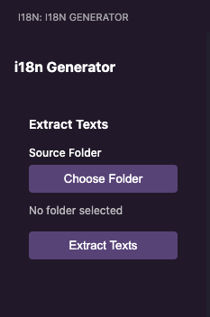
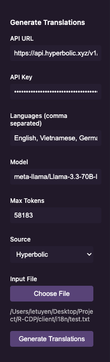
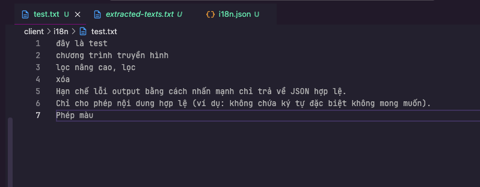
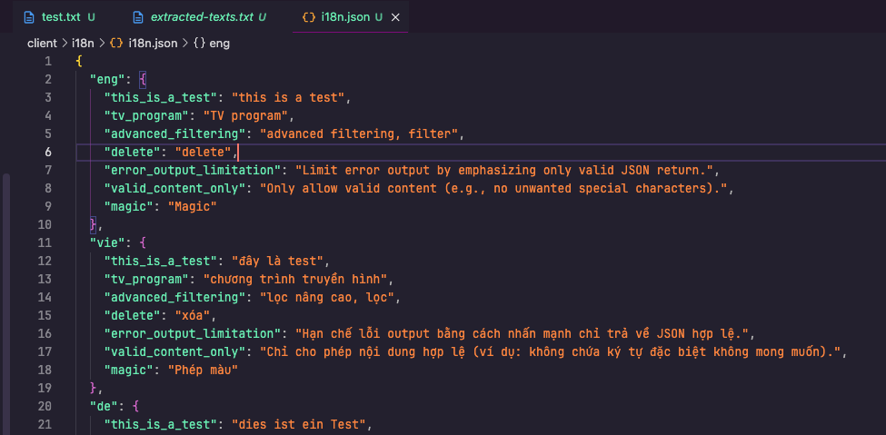

# VS Code i18n Generator Extension

A Visual Studio Code extension to help generate i18n translation files from your source code. This extension supports automatic text extraction from your codebase and translation generation using AI.

## Features

- 📝 Extract translatable texts from your source code
- 🔄 Generate translations using AI models
- 🌐 Support for multiple languages
- 📁 Easy file and folder selection
- 🎯 Smart text extraction with filtering

## Installation

1. Clone this repository

```bash
git clone https://github.com/LeTuyen-Kami/I18n-generator.git
```

2. Install dependencies

```bash
npm install
```

3. Open in VS Code and press F5 to run the extension in development mode

## Usage

### 1. Extract Texts from Source Code

1. Click on the i18n Generator icon in the Activity Bar
2. In the "Extract Texts" section, click "Choose Folder" to select your source code folder
3. Click "Extract Texts" to analyze your code and extract translatable strings
4. A text file will be generated with all extracted strings



### 2. Generate Translations

1. Configure your API settings:
   - Enter your API URL (e.g., http://localhost:11434/api/generate for local LLM)
   - Enter your API Key
   - Specify target languages (comma-separated, e.g., "en,vi,fr")
2. Click "Choose File" to select the text file containing strings to translate
3. Click "Generate Translations" to start the translation process
4. When complete, you can view the generated i18n.json file
5. The extension is compatible with app.hyperbolic.xyz, which is currently free to use. If you plan to use a different service, you may need to modify the code accordingly.





## Supported File Types

The text extraction supports the following file types:

- JavaScript (.js)
- TypeScript (.ts)
- React (.jsx)
- React TypeScript (.tsx)

## Configuration

The extension will automatically ignore:

- URLs
- Email addresses
- Single words without spaces
- Numbers
- Punctuation marks
- Empty strings

## Generated Output

The extension generates a JSON file in the following format:

```json
{
  "eng": {
    "meaningful_key": "English translation",
    ...
  },
  "vie": {
    "meaningful_key": "Vietnamese translation",
    ...
  }
}
```

## Requirements

- Visual Studio Code 1.75.0 or higher
- Node.js and npm installed
- Access to an AI translation API (local or remote)

## Development

To contribute to this extension:

1. Fork the repository
2. Create a feature branch
3. Make your changes
4. Submit a pull request

## License

ISC License
